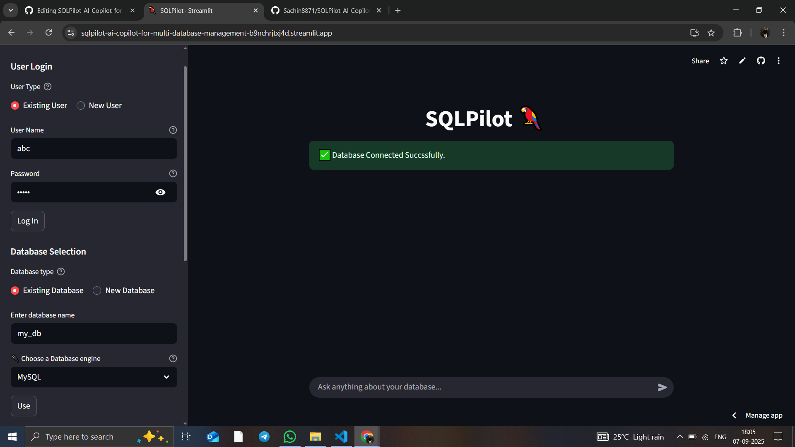
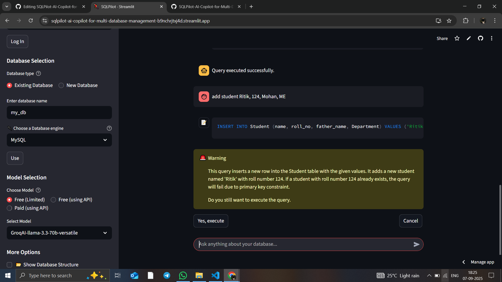

# SQLPilot — AI Copilot for Multi‑Database Management 🚀

[](https://streamlit.io/)
[](https://www.langchain.com/)
[](https://groq.com/)


SQLPilot is an **AI‑powered SQL management system** that lets you **connect, explore, and query multiple databases** from a clean Streamlit UI. It integrates **LangChain** and **LangGraph** (for reasoning + tools) and **LLM** like **GPT, Gemini, Groq** (for fast LLM inference) to convert **natural language into SQL**, run it safely, and show results instantly.

> Speak to your data: _“show the top 10 customers by revenue this quarter”_ ➜ SQLPilot generates schema‑aware SQL, executes it, and renders a nice table—no context switching, no boilerplate.

---

## 🔗 Live Demo  

Try SQLPilot instantly on Streamlit Cloud:  

👉 [SQLPilot Live Demo](https://sqlpilot-ai-copilot-for-multi-database-management-b9nchrjtxj4d.streamlit.app/)


## 📝 How To Use  

- **Create an Account**: Enter a username and password to register as a new user, or log in if you already have an account.  
  _(Do not use your personal credentials.)_  

- **Your Existing Database**: After logging in, you can view any existing databases linked to your account.  

- **Create Database**: If you don’t have a database yet, enter a database name and select an engine (**MySQL, SQLite, or PostgreSQL**) to create   one.

- **Choose a Model (LLM)**: SQLPilot provides three ways to access AI models:  

  #### 1. Free but Limited  
  Use the model via my shared API key. This is quick to start but **usage is limited**.  

  #### 2. Free Using Your Own API (Recommended)  
  These models are free to use with a **daily token limit**.  
  You need to generate your own API key by signing up on the model provider’s official website.  

  #### 3. Paid Using Your Own API  
  These models require a paid subscription but provide the **best performance and reliability**.  
  Purchase an API key from the provider’s official website to use this option.  

- **Use SQLPilot**: Now you can interact with SQLPilot like a chatbot (similar to ChatGPT). You can:  
  - Create new tables  
  - Insert data  
  - Query data using **natural language prompts**  

- **Extra Features**:  
  - Delete databases and accounts  
  - Create tables from CSV files (great for large datasets)  
  - Explore database structure at any time  


## ✨ Key Features

- 🔗 **Multi‑DB Support**: MySQL, PostgreSQL, and SQLite.
- 🤖 **AI Copilot**: Natural‑language → SQL using LangChain + LangGraph + LLM; schema‑aware prompting.
- 🗂️ **CSV → Table**: Upload a CSV to auto‑create a new table in the selected database.
- 🧭 **DB Explorer**: Browse databases, schemas, tables, and sample rows.
- ⚡ **One‑Click Run**: Execute generated or manual SQL and view results in Streamlit.
- 💾 **Export**: Download query results as CSV.
- 🔒 **Secrets‑First**: Environment variables and optional `st.secrets` integrated.
- 🧩 **Modular Design**: Clean separation of connection, fetching, query execution, and AI graph.

---

## 🧱 Architecture (High‑Level)

```
+---------------------+       +-----------------+
|  Streamlit UI       |       |   AI Copilot    |
|  - Sidebar (DB)     |<----->|   -LangChain    |
|  - Query Console    |       |   -LangGraph    |
|  - Results Viewer   |       +-----------------+
+----------+----------+                |
           |                           v
           |                     +-----------+
           |                     |  LLM API  |
           |                     +-----------+
           v
+------------------------------+
|         DB Connectors        |
|   MySQL | Postgres | SQLite  |
+------------------------------+
```

- **Streamlit UI** handles the app flow and rendering.
- **LangChain, LnagGraph** orchestrates prompt → SQL generation using schema context.
- **Connectors** provide safe DB access and query execution.

---

## 🧩 Supported Databases

- **MySQL** (8.x)
- **PostgreSQL** (14+)
- **SQLite** (3.x)

> SQL Server / Oracle / MongoDB are on the roadmap (see below).

---

## 🖼️ Demo & Screenshots





---

## 🚀 Quickstart

### 1) Clone

```bash
git clone https://github.com/Sachin8871/SQLPilot-AI-Copilot-for-Multi-Database-Management.git
cd SQLPilot-AI-Copilot-for-Multi-Database-Management
```

### 2) Create a virtual environment & install deps

```bash
python -m venv venv
# Windows:
venv\\Scripts\\activate
# macOS/Linux:
# source venv/bin/activate

pip install --upgrade pip
pip install -r requirements.txt
```

> If you don’t have `requirements.txt` yet, here’s a sane starting point (pin versions as you prefer):
>
> ```txt
> streamlit>=1.36
> python-dotenv>=1.0
> pandas>=2.2
> numpy>=1.26
> sqlalchemy>=2.0
> mysql-connector-python>=9.0
> psycopg2-binary>=2.9
> pyodbc>=5.1
> langchain>=0.2
> langchain-core>=0.2
> langchain-community>=0.2
> groq>=0.9
> ```

### 3) Configure environment

Create a `.env` in the project root:

```ini
# -------- MySQL --------
MYSQL_HOST=localhost
MYSQL_PORT=3306
MYSQL_USER=root
MYSQL_PASSWORD=your_mysql_password

# ------ PostgreSQL ------
POSTGRES_HOST=localhost
POSTGRES_PORT=5432
POSTGRES_USER=postgres
POSTGRES_PASSWORD=your_postgres_password

# ---- SQL Server (ODBC) ----
MSSQL_DSN=your_odbc_dsn_name   # or hostname if you connect directly
MSSQL_USER=sa
MSSQL_PASSWORD=your_mssql_password

# -------- SQLite --------
SQLITE_PATH=./data/app.db

# --------- AI / LLM ---------
GROQ_API_KEY=your_groq_api_key
```

Alternatively, you can use **Streamlit secrets** (`.streamlit/secrets.toml`):

```toml
[mysql]
host = "localhost"
port = 3306
user = "root"
password = "pass"

[postgres]
host = "localhost"
port = 5432
user = "postgres"
password = "pass"

[mssql]
dsn = "MyMSSQL"
user = "sa"
password = "pass"

[sqlite]
path = "data/app.db"

[groq]
api_key = "your_groq_api_key"
```

### 4) Run

```bash
streamlit run app.py
```

Open the URL Streamlit prints (usually http://localhost:8501).

---

## 🧭 Usage Walkthrough

1. **Choose a database** from the sidebar and provide credentials (or use secrets).
2. (Optional) **Upload CSV** → preview → **Create table** in the selected database.
3. Type a **plain‑English question** in the AI panel (e.g., “top 10 products by sales last month”).  
   - SQLPilot builds a **schema snapshot** and asks the LLM for a **safe SQL** query.
4. Review the generated SQL (editable), hit **Run**.
5. Explore results, then **Download as CSV** if needed.

---

## 📁 Project Structure (suggested)

```
SQLPilot/
├─ app.py                        # Streamlit entrypoint
├─ Modules/
│  ├─ connect.py                 # DB connectors / session mgmt
│  ├─ fetch_database.py          # List DBs, schemas, tables, columns
│  ├─ query_execution.py         # Safe execution + exports
│  ├─ table_via_csv.py           # CSV → table workflow
│  ├─ sign_in.py                 # Optional auth or connection UI
│  └─ __init__.py
├─ graph.py                      # LangChain graph / tools
├─ assets/                       # Images / GIFs for README
├─ data/                         # Local SQLite or sample datasets
├─ requirements.txt
├─ .env                          # Local env vars (never commit)
└─ README.md
```

> Your current repo already contains `app.py`, a `Modules/` folder (with `sign_in`, `fetch_database`, `query_execution`, etc.), and a `graph/` with the LangChain graph. Keep file names consistent with imports used in code.

---

## ⚙️ Configuration Notes

- **MySQL**: Uses `mysql-connector-python`. Ensure user has `CREATE TABLE` if using CSV import.
- **PostgreSQL**: Uses `psycopg2-binary`. For SSL / cloud providers, provide extra args in your connector.
- **SQL Server**: `pyodbc` requires a DSN or driver installed (e.g., ODBC Driver 18 for SQL Server).
- **SQLite**: Path should exist or be creatable by the running process.
- **LangChain + Groq**: Keep prompts compact; include relevant schema only to reduce token usage & latency.

---

## 🔒 Security & Best Practices

- **Never commit** `.env`, database credentials, or production connection strings.
- Prefer **least‑privilege** DB users, especially in shared environments.
- Validate user‑edited SQL before execution if exposing to non‑technical users.
- Consider **row‑level security** and **read‑only roles** for analytics‑only contexts.
- When deploying publicly, place SQLPilot behind an auth layer (e.g., Streamlit auth / reverse proxy SSO).

---

## 🧰 Troubleshooting

- `psycopg2` build errors on Windows → install `psycopg2-binary` (already in requirements above).
- `pyodbc` driver issues → ensure **ODBC Driver 18 for SQL Server** is installed and DSN is configured.
- `groq` auth errors → check `GROQ_API_KEY` and organization settings.
- Streamlit crashes on large results → paginate queries or `LIMIT` rows in generation prompt.
- Unicode issues when reading CSVs → pass `encoding="utf-8"` to Pandas `read_csv`.

---

## ❓ FAQ

**Q: Can I write my own SQL instead of using the AI?**  
A: Yes—paste SQL into the editor and hit **Run**.

**Q: How does the AI know my schema?**  
A: The app fetches table/column info from the selected DB and provides a compact summary to the LLM prompt.

**Q: Is my data sent to Groq?**  
A: Only the text prompt + a lightweight schema summary is sent. Avoid sending sensitive values in prompts. You control what goes into the prompt logic.

**Q: Can I add Oracle or MongoDB?**  
A: Yes—extend `Modules/connect.py` with new drivers and register them in the UI. See **Roadmap**.

---

## 🗺️ Roadmap

- [ ] Query history & saved prompts
- [ ] Visualizations (tables ➜ charts)
- [ ] Row‑level security presets
- [ ] Vector‑based schema memory for big warehouses
- [ ] Oracle & MongoDB connectors
- [ ] Dockerized one‑click deployment

---

## 🤝 Contributing

Contributions are welcome—issues and PRs make the project better for everyone.

1. Fork the repo
2. Create your feature branch (`git checkout -b feat/amazing`)
3. Commit changes (`git commit -m "feat: add amazing"`)
4. Push to the branch (`git push origin feat/amazing`)
5. Open a Pull Request

Please include a clear description, screenshots (if UI), and tests where practical.

---

## 📄 License

This project is licensed under the **MIT License**—see `LICENSE` for details.

---

## 🙌 Acknowledgments

- **Streamlit** for the delightful developer experience
- **LangChain** for tool‑oriented orchestration
- **Groq** for low‑latency LLM inference
- Early feedback from friends & contributors 💙

---

### ⭐ If you find SQLPilot helpful, consider giving the repo a star!
